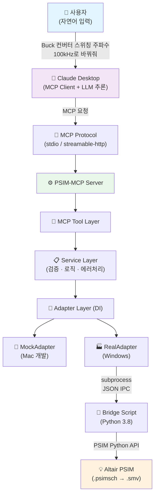
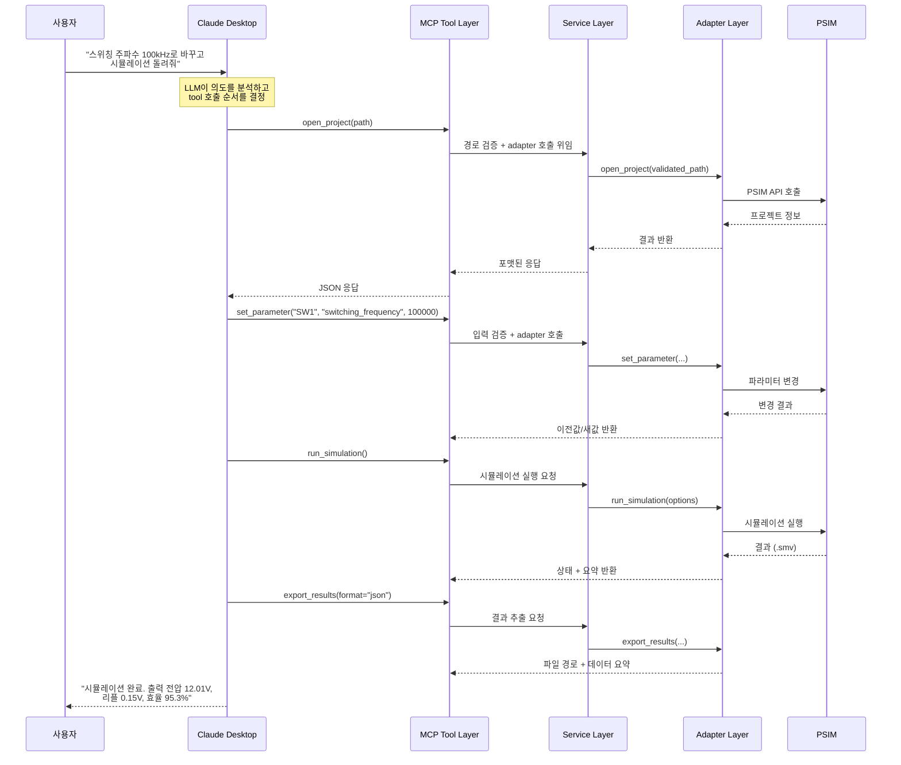
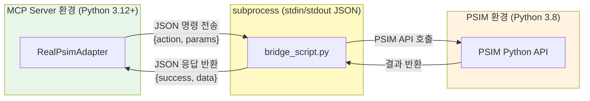
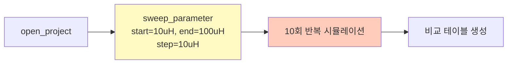
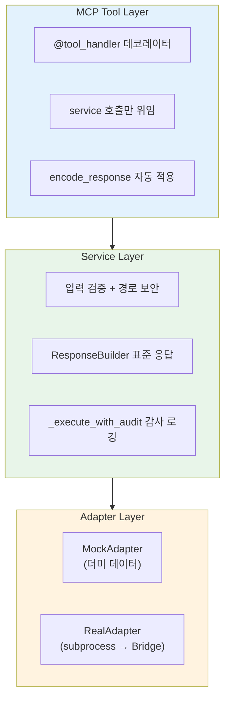
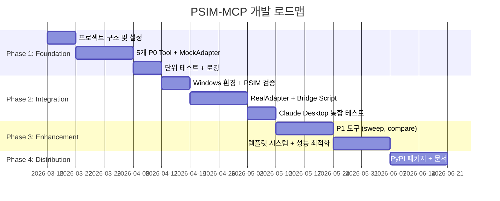

# PSIM-MCP Server

> Claude Desktop에서 자연어로 Altair PSIM 전력전자 시뮬레이션을 제어하는 MCP(Model Context Protocol) 서버

---

## 왜 PSIM-MCP가 필요한가?

### 현재의 문제

전력전자 엔지니어와 연구자들은 Altair PSIM을 사용하여 회로 시뮬레이션을 수행합니다. 하지만 현재 워크플로우에는 명확한 한계가 있습니다:

| 문제 | 설명 |
|------|------|
| **GUI 의존적 작업** | 모든 시뮬레이션 작업이 PSIM GUI를 통해서만 가능하여, 파라미터 하나를 바꾸더라도 마우스 클릭을 반복해야 합니다 |
| **반복 작업의 비효율** | 파라미터 스윕(예: 인덕턴스 10uH→100uH, 10단계)을 수행하려면 동일한 작업을 10번 수동 반복해야 합니다 |
| **결과 비교의 어려움** | 여러 시뮬레이션 결과를 비교하려면 각각의 결과 파일을 수동으로 열어 데이터를 추출해야 합니다 |
| **자동화 접근성 부족** | PSIM Python API가 존재하지만 문서가 부족하고, 자연어 기반 접근 방식이 없어 활용도가 낮습니다 |

### PSIM-MCP가 제공하는 해결책

PSIM-MCP Server는 MCP 프로토콜을 통해 Claude Desktop과 PSIM을 연결합니다. 엔지니어는 자연어로 시뮬레이션 워크플로우를 자동화할 수 있습니다:

```
사용자: "Buck 컨버터의 스위칭 주파수를 100kHz로 바꾸고 시뮬레이션 돌려줘"
Claude: open_project → set_parameter → run_simulation → export_results
        → "시뮬레이션이 완료되었습니다. 출력 전압 평균 12.01V, 리플 0.15V, 효율 95.3%입니다."
```

**핵심 가치**:
- 자연어 명령으로 PSIM 시뮬레이션의 전체 워크플로우를 자동화
- 파라미터 스윕, 결과 비교 등 반복 작업을 한 번의 명령으로 처리
- Mac에서 mock 모드로 개발/테스트, Windows에서 실제 PSIM 연동

---

## 시스템 아키텍처

### 전체 흐름도



### 요청 처리 흐름



### 이중 Python 환경 처리

PSIM Python API는 번들 Python 3.8에서만 동작하고, MCP SDK는 Python 3.10+를 요구합니다. 이 문제를 subprocess 기반 브릿지로 해결합니다:



---

## 핵심 기능 (MCP Tools)

### P0 — 핵심 도구 (Must Have)

| Tool | 설명 | 입력 | 출력 |
|------|------|------|------|
| `open_project` | PSIM 프로젝트 파일(`.psimsch`)을 열고 정보 반환 | 파일 경로 | 프로젝트명, 컴포넌트 목록, 파라미터 수 |
| `set_parameter` | 컴포넌트 파라미터 변경 | 컴포넌트ID, 파라미터명, 값 | 이전값/새값, 단위 |
| `run_simulation` | 시뮬레이션 실행 | 타임스텝, 총시간, 타임아웃 (모두 선택) | 상태, 소요시간, 결과 파일, 요약 지표 |
| `export_results` | 결과를 JSON/CSV로 내보내기 | 출력 디렉터리, 형식, 신호 목록 | 파일 경로, 데이터 포인트 수 |
| `get_status` | 서버/PSIM 상태 조회 | 없음 | 모드, 연결 상태, 프로젝트 정보 |

### P1 — 중요 도구 (Should Have)

| Tool | 설명 |
|------|------|
| `sweep_parameter` | 파라미터 범위 스윕 + 반복 시뮬레이션 |
| `get_project_info` | 열린 프로젝트의 상세 구조 반환 |
| `compare_results` | 두 시뮬레이션 결과 비교 |

---

## 프로젝트 구조

```
psim-mcp/
├── src/
│   └── psim_mcp/
│       ├── __init__.py
│       ├── server.py              # App factory (create_app, create_service, create_adapter)
│       ├── config.py              # 환경 변수 기반 설정 (Pydantic) + real 모드 검증
│       ├── tools/                 # MCP Tool 정의
│       │   ├── __init__.py        # tool_handler 데코레이터, encode_response
│       │   ├── project.py         # open_project, get_project_info
│       │   ├── parameter.py       # set_parameter, sweep_parameter
│       │   ├── simulation.py      # run_simulation
│       │   └── results.py         # export_results, compare_results, get_status
│       ├── services/              # 비즈니스 로직
│       │   ├── simulation_service.py  # 오케스트레이션 + _execute_with_audit
│       │   ├── response.py        # ResponseBuilder (표준 응답 envelope)
│       │   └── validators.py      # 입력 검증 (경로, 파라미터, 시뮬레이션 옵션)
│       ├── adapters/              # PSIM 실행 환경 추상화
│       │   ├── base.py            # BasePsimAdapter (ABC + is_project_open)
│       │   ├── mock_adapter.py    # Mac 개발용 mock
│       │   └── real_adapter.py    # Windows PSIM 연동 (sanitized env)
│       ├── bridge/
│       │   └── bridge_script.py   # PSIM Python 3.8 브릿지 (JSON IPC)
│       ├── models/
│       │   └── schemas.py         # Pydantic 데이터 모델 (Field 제약 포함)
│       └── utils/
│           ├── logging.py         # 구조화된 로깅 + SecurityAuditLogger
│           ├── paths.py           # 경로 보안 유틸리티
│           └── sanitize.py        # 출력 sanitization (LLM 컨텍스트, 응답 크기 제한)
├── tests/
│   ├── conftest.py
│   ├── unit/                      # 221개 단위 테스트
│   └── integration/               # Windows + PSIM 통합 테스트
├── docs/
│   ├── PRD.md                     # 제품 요구사항
│   ├── architecture.md            # 시스템 아키텍처
│   ├── api-spec.md                # MCP Tool API 명세
│   ├── development-guide.md       # 개발 가이드
│   ├── testing-guide.md           # 테스트 코드 작성 가이드
│   ├── security.md                # 애플리케이션 보안
│   └── security-mcp.md            # MCP 프로토콜 보안
├── main.py                        # psim_mcp.server.main() 위임
├── pyproject.toml
├── .env.example
└── README.md
```

---

## 빠른 시작

### 1. 설치

```bash
git clone <repository-url>
cd psim-mcp
uv sync --all-extras   # dev 의존성(pytest, ruff 등) 포함
```

### 2. 환경 설정

```bash
cp .env.example .env
```

**Mac (mock 모드)**:
```env
PSIM_MODE=mock
LOG_LEVEL=DEBUG
```

**Windows (real 모드)**:
```env
PSIM_MODE=real
PSIM_PATH=C:\Altair\Altair_PSIM_2025
PSIM_PYTHON_EXE=C:\Program Files\Altair\2025\common\python\python3.8\win64\python.exe
PSIM_PROJECT_DIR=C:\work\psim-projects
PSIM_OUTPUT_DIR=C:\work\psim-output
```

### 3. 서버 실행

```bash
uv run python -m psim_mcp.server
```

### 4. Claude Desktop 연동

`claude_desktop_config.json`에 추가:

```json
{
  "mcpServers": {
    "psim": {
      "command": "uv",
      "args": [
        "--directory", "/path/to/psim-mcp",
        "run", "python", "-m", "psim_mcp.server"
      ],
      "env": {
        "PSIM_MODE": "mock"
      }
    }
  }
}
```

### 5. 테스트 실행

```bash
# 전체 단위 테스트 (221개, Mac/Windows)
uv run pytest tests/unit/ -v

# 통합 테스트 (Windows + PSIM)
PSIM_MODE=real uv run pytest tests/integration/ -v

# 커버리지 리포트
uv run pytest tests/unit/ --cov=psim_mcp --cov-report=html
```

**테스트 카테고리 (221개)**:

| 카테고리 | 테스트 수 | 대상 |
|----------|----------|------|
| validators | 42 | 입력 검증 함수 |
| schemas | 21 | Pydantic 모델 |
| path_security | 17 | 경로 보안 |
| mock_adapter | 15 | MockAdapter |
| simulation_service | 12 | Service Layer |
| error_responses | 13 | 에러 응답 일관성 |
| sanitize | 22 | 출력 sanitization |
| security_validation | 24 | 보안 검증 |
| security_audit | 14 | 감사 로깅 |
| error_sanitization | 10 | 에러 정보 누출 방지 |
| app_factory | 7 | 앱 팩토리 |
| tool_wrapper | 6 | tool_handler 데코레이터 |
| response_builder | 6 | ResponseBuilder |
| tool_integration | 7 | Tool E2E 워크플로우 |
| startup_validation | 5 | 설정 검증 |

---

## 사용 시나리오

### 기본 시뮬레이션 워크플로우


> **사용자**: "Buck 컨버터 프로젝트를 열고, 스위칭 주파수를 100kHz로 변경한 다음 시뮬레이션 돌려서 결과 보여줘"

### 파라미터 스윕 워크플로우



> **사용자**: "인덕턴스를 10uH에서 100uH까지 10uH 단위로 바꿔가면서 시뮬레이션 돌리고 출력 리플 비교해줘"

---

## 설계 원칙

### App Factory 패턴

서버 초기화는 `create_app()` 팩토리를 통해 이루어집니다. 테스트에서 독립적인 인스턴스를 생성할 수 있고, `import` 시점에 무거운 초기화가 발생하지 않습니다.

```python
from psim_mcp.server import create_app
from psim_mcp.config import AppConfig

# 커스텀 설정으로 앱 생성
config = AppConfig(psim_mode="mock")
app = create_app(config)
```

### 레이어 구조



| 레이어 | 책임 | 핵심 구현 |
|--------|------|----------|
| **Tool Layer** | MCP 프로토콜 인터페이스 | `@tool_handler` 데코레이터로 예외 처리/직렬화/sanitize 자동화 |
| **Service Layer** | 검증, 오케스트레이션, 감사 | `ResponseBuilder`로 응답 표준화, `_execute_with_audit`로 감사 로깅 |
| **Adapter Layer** | PSIM 실행 환경 추상화 | `is_project_open` 프로퍼티, DI로 mock/real 교체 |

---

## 환경 변수

| 변수 | 기본값 | 설명 |
|------|--------|------|
| `PSIM_MODE` | `mock` | 동작 모드 (`mock` \| `real`) |
| `PSIM_PATH` | — | PSIM 설치 경로 (real 모드 전용) |
| `PSIM_PYTHON_EXE` | — | PSIM 번들 Python 3.8 경로 |
| `PSIM_PROJECT_DIR` | — | PSIM 프로젝트 디렉터리 |
| `PSIM_OUTPUT_DIR` | — | 결과 출력 디렉터리 |
| `LOG_DIR` | `./logs` | 로그 저장 디렉터리 |
| `LOG_LEVEL` | `INFO` | 로그 레벨 |
| `SIMULATION_TIMEOUT` | `300` | 시뮬레이션 타임아웃 (초) |
| `MAX_SWEEP_STEPS` | `100` | 파라미터 스윕 최대 단계 수 |
| `ALLOWED_PROJECT_DIRS` | — | 허용 디렉터리 (쉼표 구분, 빈 값=제한 없음) |

---

## 개발 로드맵



| Phase | 환경 | 모드 | 주요 목표 |
|-------|------|------|-----------|
| **1. Foundation** | Mac | mock | 서버 골격, 5개 P0 tool, MockAdapter, 단위 테스트 |
| **2. Integration** | Windows | real | PSIM 연결, Bridge Script, RealAdapter, 통합 테스트 |
| **3. Enhancement** | 모두 | 모두 | P1 도구(sweep, compare), 템플릿, 성능 최적화 |
| **4. Distribution** | 원격 | real | PyPI 배포, Streamable HTTP, OAuth, 사용자 문서 |

---

## 보안

### 입력 보안
- **경로 보안**: `Path.resolve()` + `is_relative_to()` 로 path traversal 방지
- **입력 검증**: Pydantic Field 제약 + 정규식 식별자 검증 + 시뮬레이션 옵션 범위 검증
- **문자열 길이 제한**: 파라미터 값 1024자, 경로 4096자, 식별자 64자

### 출력 보안
- **LLM 컨텍스트 sanitization**: 제어 문자, prompt injection 패턴 제거 (`sanitize_for_llm_context`)
- **응답 크기 제한**: 50KB 초과 시 자동 truncation (`truncate_response`)
- **에러 메시지 보호**: 전체 시스템 경로, 스택 트레이스, 원시 예외 메시지를 사용자에게 노출하지 않음

### subprocess 보안
- **명령 주입 방지**: `shell=False`, JSON 입력은 stdin으로 전달
- **환경 격리**: `_get_sanitized_env()`로 최소 환경변수만 subprocess에 전달

### 감사 로깅
- **SecurityAuditLogger**: 보안 이벤트(path_blocked, invalid_input, subprocess_event) 전용 로거
- **입력 해싱**: 감사 로그에 원본 대신 SHA-256 해시 기록 (`hash_input`)
- **4개 로그 파일 분리**: `server.log`, `tools.log`, `psim.log`, `security.log`

### 리소스 제한
- 시뮬레이션 타임아웃(300s), 스윕 최대 100단계, total_time 최대 3600s

자세한 보안 설계는 [`docs/security.md`](./docs/security.md)와 [`docs/security-mcp.md`](./docs/security-mcp.md)를 참조하세요.

---

## 문서

| 문서 | 설명 |
|------|------|
| [`docs/PRD.md`](./docs/PRD.md) | 제품 요구사항 정의서 |
| [`docs/architecture.md`](./docs/architecture.md) | 시스템 아키텍처 설계 |
| [`docs/api-spec.md`](./docs/api-spec.md) | MCP Tool API 상세 명세 |
| [`docs/development-guide.md`](./docs/development-guide.md) | 개발 환경 구성 및 단계별 가이드 |
| [`docs/testing-guide.md`](./docs/testing-guide.md) | 테스트 코드 작성 및 실행 가이드 |
| [`docs/security.md`](./docs/security.md) | 애플리케이션 보안 (파일 시스템, 입력 검증) |
| [`docs/security-mcp.md`](./docs/security-mcp.md) | MCP 프로토콜 보안 (Prompt Injection, Transport) |

---

## 개발자 가이드

### App Factory를 활용한 테스트

```python
from psim_mcp.server import create_app, create_service
from psim_mcp.config import AppConfig

# 독립 인스턴스로 테스트 — 전역 상태 없음
config = AppConfig(psim_mode="mock", simulation_timeout=10)
service = create_service(config)

result = await service.get_status()
assert result["success"] is True
```

### 새 Tool 추가하기

`@tool_handler` 데코레이터로 보일러플레이트 없이 tool을 추가할 수 있습니다:

```python
# src/psim_mcp/tools/my_tool.py
from psim_mcp.tools import tool_handler

def register_tools(mcp, service=None):
    @mcp.tool(description="새 도구 설명")
    @tool_handler("my_new_tool")
    async def my_new_tool(param: str) -> str:
        svc = service or _get_service()
        return await svc.some_method(param)
        # 예외 처리, JSON 직렬화, sanitize, truncate는 데코레이터가 처리
```

---

## 기술 스택

| 항목 | 기술 |
|------|------|
| 언어 | Python 3.12+ |
| MCP 프레임워크 | FastMCP (`mcp>=1.0`) |
| 데이터 검증 | Pydantic v2 + Field 제약 |
| 설정 관리 | pydantic-settings + python-dotenv |
| 테스트 | pytest + pytest-asyncio (221개) |
| 린터/포매터 | ruff |
| 패키지 관리 | uv |
| 빌드 시스템 | hatchling |

---

## 라이선스

TBD
