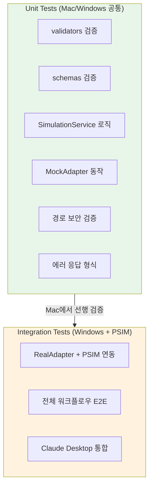

# PSIM-MCP Server: 테스트 코드 작성 가이드

> **버전**: v1.0
> **작성일**: 2026-03-15
> **상위 문서**: [PRD.md](./PRD.md) | [architecture.md](./architecture.md) | [development-guide.md](./development-guide.md)

---

## 1. 테스트 전략 개요

PSIM-MCP Server는 **Mac에서 mock 모드로 개발하고 Windows에서 실제 PSIM과 통합**하는 이중 환경 전략을 따릅니다. 테스트 역시 이 전략에 맞춰 두 단계로 구성됩니다.



---

## 2. 디렉터리 구조

```
tests/
├── __init__.py
├── conftest.py                    # 공통 fixture 정의
├── unit/                          # 단위 테스트 (Mac/Windows 공통)
│   ├── __init__.py
│   ├── test_validators.py         # 입력 검증 로직
│   ├── test_schemas.py            # Pydantic 모델 검증
│   ├── test_simulation_service.py # Service Layer 비즈니스 로직
│   ├── test_mock_adapter.py       # MockAdapter 동작 검증
│   ├── test_path_security.py      # 경로 보안 (path traversal)
│   └── test_error_responses.py    # 에러 응답 형식 검증
└── integration/                   # 통합 테스트 (Windows + PSIM)
    ├── __init__.py
    ├── test_real_adapter.py       # RealAdapter + PSIM 연동
    ├── test_full_workflow.py      # 전체 워크플로우 E2E
    └── test_claude_desktop.py     # Claude Desktop MCP 통합
```

---

## 3. 공통 Fixture (`conftest.py`)

```python
# tests/conftest.py
import pytest
from pathlib import Path
from psim_mcp.config import AppConfig
from psim_mcp.adapters.mock_adapter import MockPsimAdapter
from psim_mcp.services.simulation_service import SimulationService


@pytest.fixture
def test_config():
    """테스트용 AppConfig. mock 모드, 임시 디렉터리 사용."""
    return AppConfig(
        psim_mode="mock",
        log_dir=Path("/tmp/psim-mcp-test-logs"),
        log_level="DEBUG",
        simulation_timeout=10,
        max_sweep_steps=5,
        allowed_project_dirs=["/tmp/test-projects"],
    )


@pytest.fixture
def mock_adapter():
    """MockPsimAdapter 인스턴스."""
    return MockPsimAdapter()


@pytest.fixture
def service(mock_adapter, test_config):
    """MockAdapter를 사용하는 SimulationService 인스턴스."""
    return SimulationService(adapter=mock_adapter, config=test_config)


@pytest.fixture
def sample_project_path(tmp_path):
    """테스트용 .psimsch 파일 경로 생성."""
    project_file = tmp_path / "test_circuit.psimsch"
    project_file.write_text("mock psimsch content")
    return str(project_file)


@pytest.fixture
def invalid_project_path():
    """존재하지 않는 프로젝트 경로."""
    return "/nonexistent/path/project.psimsch"
```

---

## 4. 단위 테스트 상세

### 4.1 Validators 테스트 (`test_validators.py`)

입력값 검증 로직이 정확하게 동작하는지 확인합니다.

```python
# tests/unit/test_validators.py
import pytest
from psim_mcp.services.validators import (
    validate_project_path,
    validate_component_id,
    validate_parameter_name,
    validate_parameter_value,
    validate_output_format,
)


class TestProjectPathValidation:
    """프로젝트 파일 경로 검증 테스트."""

    def test_valid_psimsch_path(self, sample_project_path):
        """정상적인 .psimsch 파일 경로는 통과해야 한다."""
        result = validate_project_path(sample_project_path)
        assert result.is_valid is True

    def test_invalid_extension(self, tmp_path):
        """'.psimsch'가 아닌 확장자는 거부해야 한다."""
        txt_file = tmp_path / "circuit.txt"
        txt_file.write_text("not a psimsch file")
        result = validate_project_path(str(txt_file))
        assert result.is_valid is False
        assert "INVALID_INPUT" in result.error_code

    def test_nonexistent_file(self):
        """존재하지 않는 파일 경로는 거부해야 한다."""
        result = validate_project_path("/nonexistent/circuit.psimsch")
        assert result.is_valid is False
        assert "FILE_NOT_FOUND" in result.error_code

    def test_path_traversal_attempt(self, tmp_path):
        """경로 탐색 공격(../)은 차단해야 한다."""
        malicious = str(tmp_path / ".." / ".." / "etc" / "passwd.psimsch")
        result = validate_project_path(malicious, allowed_dirs=[str(tmp_path)])
        assert result.is_valid is False
        assert "PATH_NOT_ALLOWED" in result.error_code

    def test_empty_path(self):
        """빈 문자열은 거부해야 한다."""
        result = validate_project_path("")
        assert result.is_valid is False


class TestComponentIdValidation:
    """컴포넌트 ID 검증 테스트."""

    @pytest.mark.parametrize("valid_id", ["V1", "SW1", "L1", "C1", "R_load"])
    def test_valid_component_ids(self, valid_id):
        """유효한 컴포넌트 ID는 통과해야 한다."""
        assert validate_component_id(valid_id) is True

    @pytest.mark.parametrize("invalid_id", ["", " ", "V1; DROP TABLE", "<script>", "a" * 256])
    def test_invalid_component_ids(self, invalid_id):
        """유효하지 않은 컴포넌트 ID는 거부해야 한다."""
        assert validate_component_id(invalid_id) is False


class TestParameterValueValidation:
    """파라미터 값 검증 테스트."""

    def test_positive_number(self):
        assert validate_parameter_value(100000) is True

    def test_zero(self):
        assert validate_parameter_value(0) is True

    def test_negative_number(self):
        """음수 값은 도메인에 따라 허용/거부 결정."""
        assert validate_parameter_value(-1) is True  # 일부 파라미터는 음수 가능

    def test_string_value(self):
        """문자열 값은 특정 파라미터에서 허용."""
        assert validate_parameter_value("sine") is True

    def test_none_value(self):
        assert validate_parameter_value(None) is False


class TestOutputFormatValidation:
    """출력 형식 검증 테스트."""

    def test_json_format(self):
        assert validate_output_format("json") is True

    def test_csv_format(self):
        assert validate_output_format("csv") is True

    def test_unsupported_format(self):
        """지원하지 않는 형식은 거부해야 한다."""
        assert validate_output_format("xml") is False
        assert validate_output_format("xlsx") is False
```

### 4.2 Pydantic Schema 테스트 (`test_schemas.py`)

데이터 모델의 직렬화/역직렬화 및 제약조건을 검증합니다.

```python
# tests/unit/test_schemas.py
import pytest
from pydantic import ValidationError
from psim_mcp.models.schemas import (
    OpenProjectRequest,
    SetParameterRequest,
    RunSimulationRequest,
    ExportResultsRequest,
    SweepParameterRequest,
    ToolResponse,
    ErrorDetail,
)


class TestOpenProjectRequest:

    def test_valid_request(self):
        req = OpenProjectRequest(path="C:\\projects\\buck.psimsch")
        assert req.path == "C:\\projects\\buck.psimsch"

    def test_empty_path_rejected(self):
        with pytest.raises(ValidationError):
            OpenProjectRequest(path="")


class TestSetParameterRequest:

    def test_valid_request(self):
        req = SetParameterRequest(
            component_id="SW1",
            parameter_name="switching_frequency",
            value=100000,
        )
        assert req.value == 100000

    def test_missing_component_id(self):
        with pytest.raises(ValidationError):
            SetParameterRequest(
                component_id="",
                parameter_name="voltage",
                value=48.0,
            )


class TestRunSimulationRequest:

    def test_defaults(self):
        req = RunSimulationRequest()
        assert req.time_step is None
        assert req.total_time is None
        assert req.timeout is None

    def test_custom_values(self):
        req = RunSimulationRequest(time_step=1e-6, total_time=0.1, timeout=60)
        assert req.time_step == 1e-6


class TestSweepParameterRequest:

    def test_valid_sweep(self):
        req = SweepParameterRequest(
            component_id="L1",
            parameter_name="inductance",
            start=10e-6,
            end=100e-6,
            step=10e-6,
        )
        assert req.start < req.end

    def test_start_greater_than_end(self):
        """start > end인 경우 ValidationError 발생."""
        with pytest.raises(ValidationError):
            SweepParameterRequest(
                component_id="L1",
                parameter_name="inductance",
                start=100e-6,
                end=10e-6,
                step=10e-6,
            )

    def test_zero_step(self):
        """step이 0이면 무한 루프 위험 → 거부."""
        with pytest.raises(ValidationError):
            SweepParameterRequest(
                component_id="L1",
                parameter_name="inductance",
                start=10e-6,
                end=100e-6,
                step=0,
            )


class TestToolResponse:

    def test_success_response(self):
        resp = ToolResponse(
            success=True,
            data={"project_name": "buck"},
            message="프로젝트가 열렸습니다.",
        )
        assert resp.success is True
        assert resp.error is None

    def test_error_response(self):
        resp = ToolResponse(
            success=False,
            error=ErrorDetail(
                code="FILE_NOT_FOUND",
                message="파일을 찾을 수 없습니다.",
                suggestion="경로를 확인해주세요.",
            ),
        )
        assert resp.success is False
        assert resp.error.code == "FILE_NOT_FOUND"
```

### 4.3 SimulationService 테스트 (`test_simulation_service.py`)

Service Layer의 핵심 비즈니스 로직을 검증합니다.

```python
# tests/unit/test_simulation_service.py
import pytest
from psim_mcp.services.simulation_service import SimulationService


@pytest.mark.asyncio
class TestOpenProject:

    async def test_success(self, service, sample_project_path):
        """정상적인 프로젝트 열기."""
        result = await service.open_project(sample_project_path)
        assert result["success"] is True
        assert "components" in result["data"]
        assert result["data"]["component_count"] > 0

    async def test_invalid_extension(self, service):
        """잘못된 확장자 → INVALID_INPUT 에러."""
        result = await service.open_project("/fake/circuit.txt")
        assert result["success"] is False
        assert result["error"]["code"] == "INVALID_INPUT"

    async def test_nonexistent_file(self, service):
        """존재하지 않는 파일 → FILE_NOT_FOUND 에러."""
        result = await service.open_project("/nonexistent/circuit.psimsch")
        assert result["success"] is False
        assert result["error"]["code"] == "FILE_NOT_FOUND"

    async def test_path_traversal_blocked(self, service):
        """경로 탐색 공격 차단."""
        result = await service.open_project("../../etc/passwd.psimsch")
        assert result["success"] is False
        assert result["error"]["code"] in ("PATH_NOT_ALLOWED", "INVALID_INPUT")


@pytest.mark.asyncio
class TestSetParameter:

    async def test_success(self, service, sample_project_path):
        """프로젝트 열기 → 파라미터 변경 성공."""
        await service.open_project(sample_project_path)
        result = await service.set_parameter("SW1", "switching_frequency", 100000)
        assert result["success"] is True
        assert result["data"]["new_value"] == 100000

    async def test_without_open_project(self, service):
        """프로젝트 미열기 상태에서 파라미터 변경 → PROJECT_NOT_OPEN."""
        result = await service.set_parameter("SW1", "switching_frequency", 100000)
        assert result["success"] is False
        assert result["error"]["code"] == "PROJECT_NOT_OPEN"

    async def test_invalid_component_id(self, service, sample_project_path):
        """존재하지 않는 컴포넌트 → INVALID_INPUT."""
        await service.open_project(sample_project_path)
        result = await service.set_parameter("NONEXISTENT", "voltage", 48.0)
        assert result["success"] is False


@pytest.mark.asyncio
class TestRunSimulation:

    async def test_success(self, service, sample_project_path):
        """프로젝트 열기 → 시뮬레이션 실행 성공."""
        await service.open_project(sample_project_path)
        result = await service.run_simulation()
        assert result["success"] is True
        assert result["data"]["status"] == "completed"
        assert "duration_seconds" in result["data"]

    async def test_without_open_project(self, service):
        """프로젝트 미열기 → PROJECT_NOT_OPEN."""
        result = await service.run_simulation()
        assert result["success"] is False
        assert result["error"]["code"] == "PROJECT_NOT_OPEN"

    async def test_with_custom_options(self, service, sample_project_path):
        """커스텀 옵션으로 시뮬레이션 실행."""
        await service.open_project(sample_project_path)
        result = await service.run_simulation(
            options={"time_step": 1e-6, "total_time": 0.1}
        )
        assert result["success"] is True


@pytest.mark.asyncio
class TestExportResults:

    async def test_success(self, service, sample_project_path, tmp_path):
        """시뮬레이션 결과 내보내기 성공."""
        await service.open_project(sample_project_path)
        await service.run_simulation()
        result = await service.export_results(
            output_dir=str(tmp_path), format="json"
        )
        assert result["success"] is True
        assert len(result["data"]["exported_files"]) > 0

    async def test_csv_format(self, service, sample_project_path, tmp_path):
        """CSV 형식으로 내보내기."""
        await service.open_project(sample_project_path)
        await service.run_simulation()
        result = await service.export_results(
            output_dir=str(tmp_path), format="csv"
        )
        assert result["success"] is True

    async def test_unsupported_format(self, service, sample_project_path, tmp_path):
        """지원하지 않는 형식 → INVALID_INPUT."""
        await service.open_project(sample_project_path)
        await service.run_simulation()
        result = await service.export_results(
            output_dir=str(tmp_path), format="xlsx"
        )
        assert result["success"] is False


@pytest.mark.asyncio
class TestGetStatus:

    async def test_mock_mode_status(self, service):
        """mock 모드 상태 조회."""
        result = await service.get_status()
        assert result["success"] is True
        assert result["data"]["mode"] == "mock"
```

### 4.4 MockAdapter 테스트 (`test_mock_adapter.py`)

MockAdapter가 모든 인터페이스를 올바르게 구현하는지 확인합니다.

```python
# tests/unit/test_mock_adapter.py
import pytest
from psim_mcp.adapters.mock_adapter import MockPsimAdapter


@pytest.mark.asyncio
class TestMockAdapter:

    async def test_open_project(self, mock_adapter):
        """프로젝트 열기 시 더미 데이터 반환."""
        result = await mock_adapter.open_project("/fake/path/buck.psimsch")
        assert "name" in result
        assert "components" in result
        assert len(result["components"]) > 0

    async def test_set_parameter(self, mock_adapter):
        """파라미터 변경 시 이전값/새값 반환."""
        await mock_adapter.open_project("/fake/path/buck.psimsch")
        result = await mock_adapter.set_parameter("SW1", "switching_frequency", 100000)
        assert "previous_value" in result or "new_value" in result

    async def test_run_simulation(self, mock_adapter):
        """시뮬레이션 실행 시 완료 상태 반환."""
        result = await mock_adapter.run_simulation()
        assert result["status"] == "completed"
        assert "duration_seconds" in result
        assert "summary" in result

    async def test_export_results(self, mock_adapter):
        """결과 내보내기 시 파일 경로 반환."""
        result = await mock_adapter.export_results("/tmp/output", "json")
        assert "exported_files" in result

    async def test_get_status(self, mock_adapter):
        """상태 조회 시 mock 모드 반환."""
        result = await mock_adapter.get_status()
        assert "mode" in result or result is not None

    async def test_get_project_info(self, mock_adapter):
        """프로젝트 정보 조회."""
        await mock_adapter.open_project("/fake/path/buck.psimsch")
        result = await mock_adapter.get_project_info()
        assert result is not None
```

### 4.5 경로 보안 테스트 (`test_path_security.py`)

Path traversal 공격 및 경로 관련 보안 로직을 집중 검증합니다.

```python
# tests/unit/test_path_security.py
import pytest
import os
from pathlib import Path
from psim_mcp.utils.paths import (
    resolve_safe_path,
    is_path_allowed,
    validate_file_extension,
)


class TestResolveSafePath:
    """경로 정규화 및 심볼릭 링크 해석 테스트."""

    def test_absolute_path(self, tmp_path):
        safe = resolve_safe_path(str(tmp_path / "file.psimsch"))
        assert Path(safe).is_absolute()

    def test_relative_path_resolved(self):
        """상대 경로는 절대 경로로 변환되어야 한다."""
        safe = resolve_safe_path("./project/file.psimsch")
        assert Path(safe).is_absolute()

    def test_parent_traversal_normalized(self, tmp_path):
        """../가 포함된 경로는 정규화되어야 한다."""
        path = str(tmp_path / "subdir" / ".." / "file.psimsch")
        safe = resolve_safe_path(path)
        assert ".." not in safe


class TestIsPathAllowed:
    """허용된 디렉터리 내 경로인지 확인하는 테스트."""

    def test_allowed_path(self, tmp_path):
        allowed_dirs = [str(tmp_path)]
        file_path = str(tmp_path / "project.psimsch")
        assert is_path_allowed(file_path, allowed_dirs) is True

    def test_disallowed_path(self, tmp_path):
        allowed_dirs = [str(tmp_path / "safe")]
        file_path = str(tmp_path / "unsafe" / "project.psimsch")
        assert is_path_allowed(file_path, allowed_dirs) is False

    def test_traversal_escape(self, tmp_path):
        """../로 허용 디렉터리를 벗어나는 시도 차단."""
        allowed_dirs = [str(tmp_path / "safe")]
        file_path = str(tmp_path / "safe" / ".." / "unsafe" / "project.psimsch")
        assert is_path_allowed(file_path, allowed_dirs) is False

    def test_empty_allowed_dirs(self):
        """허용 디렉터리가 비어있으면 모든 경로 허용 (개발 모드)."""
        assert is_path_allowed("/any/path/file.psimsch", []) is True

    @pytest.mark.skipif(os.name == "nt", reason="Unix symlink test")
    def test_symlink_escape(self, tmp_path):
        """심볼릭 링크를 통한 탈출 차단."""
        safe_dir = tmp_path / "safe"
        safe_dir.mkdir()
        unsafe_dir = tmp_path / "unsafe"
        unsafe_dir.mkdir()
        (unsafe_dir / "secret.psimsch").write_text("secret")

        link = safe_dir / "link.psimsch"
        link.symlink_to(unsafe_dir / "secret.psimsch")

        allowed_dirs = [str(safe_dir)]
        assert is_path_allowed(str(link), allowed_dirs) is False


class TestValidateFileExtension:
    """파일 확장자 검증 테스트."""

    def test_psimsch_extension(self):
        assert validate_file_extension("circuit.psimsch") is True

    def test_wrong_extension(self):
        assert validate_file_extension("circuit.txt") is False
        assert validate_file_extension("circuit.py") is False

    def test_no_extension(self):
        assert validate_file_extension("circuit") is False

    def test_double_extension(self):
        """이중 확장자 처리."""
        assert validate_file_extension("circuit.psimsch.bak") is False

    def test_case_sensitivity(self):
        """확장자 대소문자 처리 (Windows 호환)."""
        assert validate_file_extension("circuit.PSIMSCH") is True
```

### 4.6 에러 응답 형식 테스트 (`test_error_responses.py`)

모든 에러 응답이 표준 형식을 따르는지 확인합니다.

```python
# tests/unit/test_error_responses.py
import pytest
from psim_mcp.services.simulation_service import SimulationService


@pytest.mark.asyncio
class TestErrorResponseFormat:
    """모든 에러 응답이 표준 형식을 따르는지 확인."""

    async def test_error_has_required_fields(self, service):
        """에러 응답에 code, message 필드가 있어야 한다."""
        result = await service.open_project("/nonexistent/path.psimsch")
        assert result["success"] is False
        assert "error" in result
        assert "code" in result["error"]
        assert "message" in result["error"]

    async def test_error_has_suggestion(self, service):
        """에러 응답에 suggestion 필드가 포함되어야 한다."""
        result = await service.open_project("/nonexistent/path.psimsch")
        assert "suggestion" in result["error"]

    async def test_success_has_no_error(self, service, sample_project_path):
        """성공 응답에는 error 필드가 없거나 null이어야 한다."""
        result = await service.open_project(sample_project_path)
        assert result["success"] is True
        assert result.get("error") is None

    async def test_success_has_data(self, service, sample_project_path):
        """성공 응답에는 data 필드가 있어야 한다."""
        result = await service.open_project(sample_project_path)
        assert "data" in result

    async def test_error_code_is_standard(self, service):
        """에러 코드가 정의된 코드 중 하나여야 한다."""
        standard_codes = {
            "INVALID_INPUT", "FILE_NOT_FOUND", "PERMISSION_DENIED",
            "PROJECT_NOT_OPEN", "PSIM_NOT_CONNECTED", "PSIM_ERROR",
            "SIMULATION_TIMEOUT", "SIMULATION_FAILED",
            "PATH_NOT_ALLOWED", "EXPORT_FAILED",
        }
        result = await service.open_project("/nonexistent/path.psimsch")
        assert result["error"]["code"] in standard_codes

    async def test_server_does_not_crash_on_error(self, service):
        """에러 상황에서 서버가 크래시하지 않아야 한다."""
        # 여러 에러 상황을 연속으로 실행
        await service.open_project("")
        await service.open_project("/bad/path.txt")
        await service.set_parameter("X", "y", 0)
        await service.run_simulation()
        # 여기까지 도달하면 크래시 없이 처리된 것
        result = await service.get_status()
        assert result["success"] is True
```

---

## 5. 통합 테스트 상세

통합 테스트는 Windows + PSIM 환경에서만 실행됩니다. `PSIM_MODE=real`이 아닌 경우 자동으로 건너뜁니다.

### 5.1 RealAdapter 통합 테스트 (`test_real_adapter.py`)

```python
# tests/integration/test_real_adapter.py
import pytest
import os

# Windows + PSIM 환경에서만 실행
pytestmark = pytest.mark.skipif(
    os.getenv("PSIM_MODE") != "real",
    reason="PSIM real mode required (set PSIM_MODE=real)",
)


@pytest.fixture
def real_adapter():
    """실제 PSIM과 연동하는 RealPsimAdapter."""
    from psim_mcp.adapters.real_adapter import RealPsimAdapter
    from psim_mcp.config import AppConfig
    config = AppConfig()
    return RealPsimAdapter(config)


@pytest.fixture
def sample_psimsch_path():
    """테스트용 .psimsch 파일 경로. 환경 변수에서 가져옴."""
    path = os.getenv("TEST_PSIMSCH_PATH")
    if not path:
        pytest.skip("TEST_PSIMSCH_PATH not set")
    return path


@pytest.mark.asyncio
class TestRealAdapterConnection:

    async def test_open_project(self, real_adapter, sample_psimsch_path):
        """실제 PSIM 프로젝트 열기."""
        result = await real_adapter.open_project(sample_psimsch_path)
        assert "name" in result
        assert len(result["components"]) > 0

    async def test_set_parameter(self, real_adapter, sample_psimsch_path):
        """실제 파라미터 변경."""
        await real_adapter.open_project(sample_psimsch_path)
        result = await real_adapter.set_parameter("V1", "voltage", 24.0)
        assert result["new_value"] == 24.0

    async def test_run_simulation(self, real_adapter, sample_psimsch_path):
        """실제 시뮬레이션 실행."""
        await real_adapter.open_project(sample_psimsch_path)
        result = await real_adapter.run_simulation()
        assert result["status"] == "completed"

    async def test_export_results(self, real_adapter, sample_psimsch_path, tmp_path):
        """실제 결과 내보내기."""
        await real_adapter.open_project(sample_psimsch_path)
        await real_adapter.run_simulation()
        result = await real_adapter.export_results(str(tmp_path), "json")
        assert len(result["exported_files"]) > 0
        # 파일이 실제로 생성되었는지 확인
        for f in result["exported_files"]:
            assert os.path.exists(f["path"])
```

### 5.2 전체 워크플로우 E2E 테스트 (`test_full_workflow.py`)

```python
# tests/integration/test_full_workflow.py
import pytest
import os

pytestmark = pytest.mark.skipif(
    os.getenv("PSIM_MODE") != "real",
    reason="PSIM real mode required",
)


@pytest.mark.asyncio
async def test_basic_simulation_workflow(real_service, sample_psimsch_path, tmp_path):
    """
    기본 시뮬레이션 워크플로우 E2E 테스트.

    흐름: open → set_parameter → run → export → get_status
    """
    # 1. 프로젝트 열기
    open_result = await real_service.open_project(sample_psimsch_path)
    assert open_result["success"] is True
    project_name = open_result["data"]["project_name"]

    # 2. 파라미터 변경
    set_result = await real_service.set_parameter("V1", "voltage", 24.0)
    assert set_result["success"] is True
    assert set_result["data"]["new_value"] == 24.0

    # 3. 시뮬레이션 실행
    sim_result = await real_service.run_simulation()
    assert sim_result["success"] is True
    assert sim_result["data"]["status"] == "completed"

    # 4. 결과 내보내기
    export_result = await real_service.export_results(
        output_dir=str(tmp_path),
        format="json",
    )
    assert export_result["success"] is True
    assert len(export_result["data"]["exported_files"]) > 0

    # 5. 상태 확인
    status = await real_service.get_status()
    assert status["success"] is True
    assert status["data"]["current_project"]["name"] == project_name


@pytest.mark.asyncio
async def test_error_recovery_workflow(real_service):
    """
    에러 발생 후 정상 작업 가능 여부 확인.

    흐름: 잘못된 파일 열기 시도 → 정상 파일 열기 → 시뮬레이션
    """
    # 실패 시도
    fail_result = await real_service.open_project("/nonexistent/path.psimsch")
    assert fail_result["success"] is False

    # 서버가 크래시하지 않고 상태 조회 가능
    status = await real_service.get_status()
    assert status["success"] is True
```

---

## 6. 테스트 실행 방법

### 6.1 기본 실행

```bash
# 전체 단위 테스트
uv run pytest tests/unit/ -v

# 특정 테스트 파일
uv run pytest tests/unit/test_validators.py -v

# 특정 테스트 클래스
uv run pytest tests/unit/test_simulation_service.py::TestOpenProject -v

# 특정 테스트 함수
uv run pytest tests/unit/test_simulation_service.py::TestOpenProject::test_success -v
```

### 6.2 통합 테스트 (Windows)

```bash
# 환경 변수 설정 필요
set PSIM_MODE=real
set TEST_PSIMSCH_PATH=C:\work\psim-projects\buck_converter.psimsch

# 실행
uv run pytest tests/integration/ -v
```

### 6.3 커버리지 리포트

```bash
# HTML 커버리지 리포트 생성
uv run pytest tests/unit/ --cov=psim_mcp --cov-report=html

# 터미널 출력
uv run pytest tests/unit/ --cov=psim_mcp --cov-report=term-missing
```

### 6.4 CI/CD에서의 실행

```yaml
# GitHub Actions 예시
- name: Run unit tests
  run: uv run pytest tests/unit/ -v --tb=short

- name: Run integration tests
  if: runner.os == 'Windows'
  env:
    PSIM_MODE: real
    TEST_PSIMSCH_PATH: ${{ secrets.TEST_PSIMSCH_PATH }}
  run: uv run pytest tests/integration/ -v
```

---

## 7. 테스트 작성 원칙

### 7.1 필수 원칙

| 원칙 | 설명 |
|------|------|
| **성공/실패 모두 테스트** | 모든 tool에 대해 정상 케이스와 에러 케이스를 포함 |
| **상태 전이 테스트** | 프로젝트 미열기 → 열기 → 시뮬레이션 등 상태 변화를 검증 |
| **보안 테스트 포함** | path traversal, 명령 주입 등 보안 관련 테스트 필수 |
| **OS 호환성 고려** | Windows/Mac 경로 차이를 `pathlib.Path`로 처리 |
| **비동기 테스트** | adapter와 service 메서드는 `@pytest.mark.asyncio` 사용 |

### 7.2 네이밍 컨벤션

```python
# 파일명: test_{대상모듈}.py
# 클래스명: Test{기능그룹}
# 함수명: test_{시나리오}_{기대결과}

# 예시
class TestOpenProject:
    async def test_valid_path_returns_project_info(self, service):
        ...
    async def test_invalid_extension_returns_error(self, service):
        ...
```

### 7.3 테스트 커버리지 목표

| 대상 | 목표 커버리지 |
|------|-------------|
| `validators.py` | 95%+ |
| `simulation_service.py` | 90%+ |
| `mock_adapter.py` | 90%+ |
| `schemas.py` | 85%+ |
| `paths.py` | 95%+ |
| **전체** | **85%+** |

---

## 8. 트러블슈팅

| 증상 | 원인 | 해결 |
|------|------|------|
| `ModuleNotFoundError: psim_mcp` | 패키지 미설치 | `uv sync` 후 재실행 |
| `pytest-asyncio` 경고 | asyncio mode 미설정 | `pyproject.toml`에 `[tool.pytest.ini_options] asyncio_mode = "auto"` 추가 |
| 통합 테스트 skip | `PSIM_MODE!=real` | `PSIM_MODE=real` 환경 변수 설정 |
| Windows 경로 에러 | 백슬래시/공백 | `pathlib.Path` 사용, raw 문자열 또는 이스케이프 처리 |
| fixture 충돌 | conftest.py 중복 | `tests/conftest.py`에만 공통 fixture 정의 |
