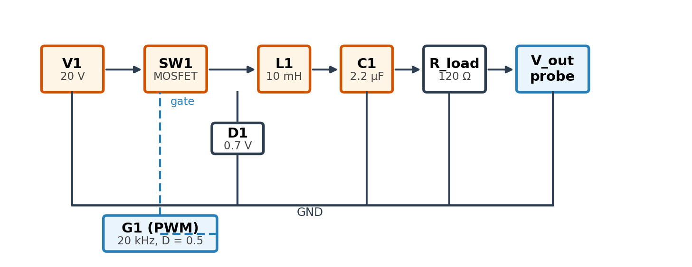
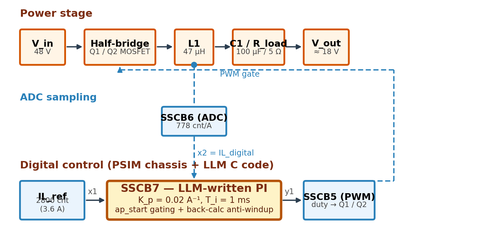

# MCP 기반 PSIM 연동형 전력전자 회로 자동 설계 시스템 구현 및 폐루프 제어기 검증

**저자**: (저자 정보)

**Keywords**: Large Language Model (LLM), Model Context Protocol (MCP), PSIM, Power Electronics, Buck Converter, Closed-Loop Control

---

## Abstract

Large Language Model (LLM) 을 외부 공학 소프트웨어와 연동하기 위한 개방형 표준으로 Model Context Protocol (MCP) 이 제안되었다. 그러나 기존 MCP 연동 사례는 범용 회로 시뮬레이터와 디지털 EDA flow 에 편중되어 있으며, 전력전자 전용 시뮬레이터에 대한 통합 사례는 아직 제한적이다. 본 논문에서는 Altair PSIM 과 LLM 을 MCP 로 연동한 **psim-mcp** 시스템을 제안한다. 제안 시스템은 자연어로 입력된 설계 사양 (입출력 전압, 출력 전력, 절연 여부 등) 으로부터 토폴로지 선정, 회로 그래프 합성, 파라미터 산정, schematic 자동 생성, PSIM 시뮬레이션 실행을 단일 파이프라인으로 수행한다. 또한 PSIM 검증 reference schematic 을 chassis 로 활용하고 LLM 이 작성한 제어기 C 코드를 SIMPLECBLOCK 에 주입함으로써 폐루프 제어 검증까지 지원한다. Buck converter 의 open-loop (20 → 10 V, 83 mA, CCM) 및 closed-loop (48 → 18 V, 3.6 A) 사례 연구로 시스템 동작을 검증하였으며, 폐루프 사례에서 LLM 이 작성한 PI 제어기는 inductor current tracking error 3.6 × 10⁻⁵ % 를 달성하였다.

---

## 1. 서    론

대규모 언어 모델 (Large Language Model, LLM) 을 외부 데이터 및 도구와 결합하려는 연구가 확대되면서, 모델과 응용 시스템 간 통신 인터페이스의 표준화 필요성이 부각되고 있다. Anthropic 이 공개한 Model Context Protocol (MCP) 은 LLM 과 외부 도구 사이의 양방향 연결을 지원하는 개방형 표준으로, 도구마다 별도로 구현해야 했던 기존 연동 방식의 한계를 완화한다 [1, 2].

MCP 를 활용한 LLM-소프트웨어 연동 시도는 MATLAB/Simulink, SPICE 계열 시뮬레이터, Verilog 및 ASIC 설계 흐름 등에서 보고되고 있다 [3–5]. 또한 LLM 을 활용한 토폴로지 합성, SPICE 피드백 기반 SMPS 설계, EDA 자동화 등의 연구는 회로 설계 및 검증에서 LLM 의 유용성을 시사한다 [6–8]. 그러나 이러한 시도는 대부분 범용 회로 시뮬레이터 또는 디지털 EDA flow 를 대상으로 하며, 전력전자 전용 시뮬레이터인 PSIM 을 자연어 기반 회로 합성·schematic 생성·시뮬레이션 실행까지 MCP 로 통합한 사례는 아직 제한적이다.

본 논문은 PSIM 과 LLM 을 MCP 로 연동한 psim-mcp 시스템을 제안한다. 제안 시스템은 자연어 설계 사양으로부터 토폴로지 선정, 회로 그래프 합성, schematic 생성, PSIM 시뮬레이션을 단일 파이프라인으로 수행한다. 또한 LLM 이 작성한 C 코드를 PSIM SIMPLECBLOCK 에 주입하여 closed-loop digital control 검증까지 지원한다.

---

## 2. 본    론

### 2.1 MCP 기반 PSIM 연동 구조

MCP 는 LLM 이 외부 도구·데이터·실행 환경과 표준화된 방식으로 상호작용하도록 지원하는 통신 인터페이스이다. 기존 LLM 자동화 시스템은 대상 소프트웨어마다 API 호출, 파일 입출력, 실행 명령을 개별 구현해야 하므로 확장성과 유지보수 측면에서 한계가 있었다. MCP 는 외부 기능을 도구 (tool) 단위로 정의하고 LLM 이 정해진 입력 형식에 따라 호출하도록 구성함으로써, LLM 과 응용 소프트웨어 사이의 결합도를 낮춘다.

본 연구는 MCP 를 LLM agent 와 PSIM 사이의 중간 계층으로 구성한다. 사용자가 입출력 전압·출력 전력·절연 여부 등의 설계 사양을 자연어로 입력하면, LLM agent 는 이를 구조화된 설계 조건으로 변환한다. MCP 서버는 변환된 조건을 받아 토폴로지 선정, 소자값 산정, 회로 그래프 생성, schematic 자동 배치·배선, PSIM 시뮬레이션을 순차적으로 수행한다. 이때 LLM 은 PSIM 파일을 직접 다루지 않고, MCP 서버에 등록된 도구 (preview_circuit, confirm_circuit, run_simulation 등) 만 호출한다.

제안 시스템은 LLM agent, MCP server, design automation module, PSIM bridge module 의 네 계층으로 구성된다 (그림 1). Design automation module 은 토폴로지 후보 선정과 소자값 계산을 담당하고, PSIM bridge module 은 schematic 생성과 시뮬레이션 실행을 담당한다. Bridge 는 PSIM 의 native Python API (psimapipy) 가 Python 3.9 환경만 지원하는 제약 때문에 별도 subprocess 로 분리되며, stdin/stdout JSON line protocol 로 MCP server 와 통신한다.

### 2.2 자연어 기반 회로 자동 설계 절차

제안 시스템의 회로 설계 파이프라인은 자연어 해석, 토폴로지 선정, 회로 그래프 합성, 자동 배치·배선, schematic 생성, 시뮬레이션 분석의 6 단계로 구성된다. 자연어 해석 단계에서 LLM agent 는 입력 전압·출력 전압·출력 전력·절연 여부 등의 주요 파라미터와 토폴로지 후보를 추출한다. 이 과정은 정규식 기반 추출, MCP sampling, hybrid 방식 중 하나로 수행한다.

토폴로지 선정 단계는 추출된 설계 조건을 바탕으로 등록된 29 개 토폴로지 중 적합한 후보를 점수화한다. LLM 의 제안값은 결정론적 ranker 가 재검증하므로, 환각 (hallucination) 에 따른 잘못된 토폴로지 선정을 방지한다. 회로 합성 단계에서는 선정된 토폴로지의 역할·블록·net 정보를 가진 CircuitGraph 를 구성하고, 주요 수동 소자값은 공학 설계식에 따라 결정론적으로 계산한다.

자동 배치·배선 단계에서는 force-directed 배치와 pin-aware trunk-branch routing 으로 핀 충돌을 최소화한 schematic 을 생성한다. PSIM 회로 생성은 컴포넌트 직접 합성과 검증 예제 회로 (reference) 의 chassis 복제 후 파라미터·C-block 치환 두 방식을 모두 지원한다. 마지막으로 PSIM 엔진이 시뮬레이션을 실행해 `.smv` 결과 파일을 생성하고, 출력 전압·전류 및 정상상태 응답을 분석한다. 그림 1 은 PSIM-MCP 시스템의 전체 아키텍처를 나타낸다.

<center>
[Fig. 1. PSIM-MCP 시스템 아키텍처]
</center>

### 2.3 사례 연구

본 절에서는 buck converter 의 open-loop 및 closed-loop 두 사례를 통해 제안 시스템의 동작을 검증한다. 각 사례별 자연어 prompt, MCP 가 생성한 PSIM schematic, 시뮬레이션 결과를 표 1 및 표 2 에 정리하였다.

#### 2.3.1 Buck Converter Open-Loop 설계

표 1 은 open-loop 사례의 자연어 입력, MCP 가 생성한 회로도, 그리고 50 ms 시뮬레이션 결과를 함께 보인다. 사양은 V_in = 20 V, V_out = 10 V, R_load = 120 Ω (I_out ≈ 83 mA), f_sw = 20 kHz 이며, 도통 모드는 continuous conduction mode (CCM) 을 가정한다. 시스템은 식 (1) 의 표준 buck 설계식을 결정론적으로 적용해 8 개 component 의 PSIM schematic 을 자동 생성한다. 설계 가정은 inductor 전류 ripple 30 % (ΔI_L = 0.3·I_out ≈ 25 mA) 와 output 전압 ripple 1 % (ΔV_o,pp = 0.01·V_out = 0.1 V) 이다.

$$D = V_\text{out}/V_\text{in} = 0.5$$

$$L_1 = \frac{V_\text{out}(1-D)}{f_\text{sw}\,\Delta I_L} = 10\ \text{mH (표준값)}$$

$$C_1 = \frac{\Delta I_L}{8\,f_\text{sw}\,\Delta V_\text{o,pp}} = 1.56\ \mu\text{F} \to \mathbf{2.2\ \mu\text{F}}\ \text{(표준값 반올림)}$$

$$R_\text{load} = 120\ \Omega \tag{1}$$

CCM 검증: 부하 I_out = V_out/R_load = 83 mA 에서 CCM 경계 인덕턴스 L_min = V_out (1−D) / (2·I_out·f_sw) = 1.5 mH 이고, 선정값 L = 10 mH > 6·L_min 이므로 CCM 운용이 보장된다.

생성된 회로의 50 ms 시뮬레이션 결과, 정상상태 (25–50 ms) 평균값은 V_out **9.65 V**, inductor current **80.4 mA**, output voltage ripple **0.76 %** 로 측정되어 목표값 대비 −3.5 % 의 정상상태 오차를 보였다 (그림 2). 또한 I_L,min = 67.4 mA > 0 으로 CCM 운용이 실측 확인되었다. 평균값은 비동기 buck 모델 V_out = D·V_in − (1−D)·V_D = 0.5 × 20 − 0.5 × 0.7 = **9.65 V** 와 0.1 % 이내로 일치하며 (V_D = 0.7 V 는 freewheel diode 의 정방향 강하), MOSFET R_DS(on) 과 인덕터 DCR 의 추가 기여는 0.02 V 미만으로 무시 가능하다. 본 사례는 토폴로지 합성에서 시뮬레이션 검증까지의 과정이 단일 자연어 prompt 로 완결됨을 보인다.

<center>

**표 1.** Open-loop buck 사례 (V_in = 20 V → V_out = 10 V, R_load = 120 Ω, CCM)

| 항목 | 내용 |
|---|---|
| **명령어** | "buck converter 만들어줘. 입력 20 V, 출력 10 V, R_load = 120 Ω, f_sw = 20 kHz, CCM" |
| **선정 소자** | L_1 = 10 mH, C_1 = 2.2 µF, R_load = 120 Ω (모두 표준 카탈로그 값) |
| **회로도** |  |
| **결과 (mean)** | V_out = **9.65 V** (−3.5 %), I_L = **80.4 mA** (CCM, I_L,min = 67 mA > 0), ripple = **0.76 %** |

[Fig. 2. Open-loop buck 50 ms 시뮬레이션 결과]

</center>

#### 2.3.2 LLM 기반 Buck Converter Closed-Loop 설계

Closed-loop 사례에서는 PSIM 의 검증된 digital-control reference schematic 을 chassis 로 그대로 사용하고, chassis 내부 SSCB7 (SIMPLECBLOCK) 의 CONTENT 만 LLM 이 작성한 C 코드로 교체하였다. 표 2 에 보인 바와 같이, 교체된 코드는 세 가지 핵심 구조를 포함한다: (i) PI 연산이 매 PSIM 시뮬레이션 step (5 ns) 이 아닌 sampling instant 에만 실행되도록 하는 **ap_start rising-edge gating**, (ii) ADC counts 와 ampere 사이의 단위 변환, (iii) 출력 saturation 시 적분기를 경계값으로 되돌리는 **back-calculation anti-windup**.

30 ms 시뮬레이션 결과, ADC 디지털 출력 IL_digital 의 평균은 2799.999 counts 로 측정되어 기준값 2800 counts 대비 tracking error **3.6 × 10⁻⁵ %** 를 보였다 (그림 3). 이는 ADC LSB (1 count ≈ 0.13 %) 의 약 1/3000 수준의 정밀도이다. 동일 구간에서 V_out 평균 18.92 V, V_out ripple 0.28 %, duty word 평균 417 (chassis 동작 범위 50 – 950 의 중간 부근, saturation 없음) 으로 안정 운용을 확인하였다.

대조군으로 ap_start gating 을 제외한 LLM 코드를 동일 chassis 에 적용했을 때는 limit cycle 발진이 발생하여 정상상태에 도달하지 못하였다. 이는 MCP tool description 의 제어 코드 작성 가이드가 LLM 출력 품질을 결정하는 핵심 변수임을 의미한다.

<center>

**표 2.** Closed-loop buck 사례 (V_in = 48 V, I_ref = 3.6 A, K_p = 0.02 A⁻¹, T_i = 1 ms)

| 항목 | 내용 |
|---|---|
| **명령어** | "buck closed-loop, 48 V → 18 V, 3.6 A 전류 제어, PI 컨트롤러 SSCB7 에 설치. K_p = 0.02, T_i = 1 ms" |
| **회로도** |  |
| **LLM-generated C 코드** | (아래 코드 박스 참조) |
| **결과 (mean)** | IL_digital = **2799.999** counts (error 3.6 × 10⁻⁵ %), V_out = **18.92 V**, ripple = **0.28 %**, Duty = 417 (no saturation) |

```c
// LLM-generated, installed into chassis SSCB7.CONTENT
static bool Flag = 0;
static float integ = 0, u_held = 0;
bool ap_start = x8;
float Kp = 0.02f, Ti = 0.001f;
float counts_per_A = 778.0f, Fsamp_eff = 12500.0f;

if (ap_start == 1 && Flag == 0) {        // rising-edge gating
    Flag = 1;
    float err = (x1 - x2) / counts_per_A;
    float dt  = 1.0f / Fsamp_eff;
    float prop = Kp * err;
    float u   = prop + (Kp / Ti) * (integ + err * dt);
    if      (u >= 1.0f) { u = 1.0f; integ = (1.0f - prop) * Ti / Kp; }
    else if (u <= 0.0f) { u = 0.0f; integ = -prop * Ti / Kp; }
    else                { integ += err * dt; }
    u_held = u;
}
if (ap_start == 0) Flag = 0;
y1 = u_held * 1000.0f;  y2 = integ;
```

[Fig. 3. Closed-loop buck — LLM-generated PI 제어기, IL_digital 이 IL_ref (2800 counts) 를 7 ms 내 정착]

</center>

---

## 3. 결    론

본 논문은 PSIM 과 대규모 언어 모델을 MCP 기반으로 연동한 psim-mcp 시스템을 제안하였다. 제안 시스템은 자연어 설계 사양으로부터 토폴로지 선정·회로 그래프 합성·자동 배치·배선·schematic 생성·시뮬레이션 실행까지의 과정을 단일 파이프라인으로 통합한다. Buck converter 의 open-loop 및 closed-loop 사례로 시스템 동작을 검증하였으며, 특히 closed-loop 사례에서는 LLM 이 작성한 PI 제어기 C 코드를 PSIM reference schematic 에 주입하여 ADC LSB 미만의 추종 정확도 (3.6 × 10⁻⁵ %) 를 확인하였다. 이는 회로 합성과 제어 알고리즘 검증을 동일한 자연어 인터페이스에서 수행할 수 있음을 의미한다.

향후 등록된 29 개 토폴로지 전반에 대해 reference schematic 정합과 closed-loop 검증 범위를 확대하고, 제어기 파라미터의 자동 조정과 시뮬레이션 피드백 기반 최적화 기능을 강화할 계획이다. 또한 타 전력전자 시뮬레이터와의 연동과 실측 데이터 기반 자동 비교 기능을 추가하여, 자연어 기반 전력전자 설계 및 검증 환경으로 확장하고자 한다.

---

## 참고문헌

[1] Anthropic, "Model Context Protocol Specification," 2024.

[2] (MCP 관련 보조 reference)

[3] (MATLAB/Simulink LLM 연동)

[4] (SPICE-LLM 연동)

[5] (Verilog/ASIC LLM 연동)

[6] (LLM 기반 topology 합성)

[7] (SPICE feedback SMPS 설계)

[8] (EDA 자동화 LLM)
